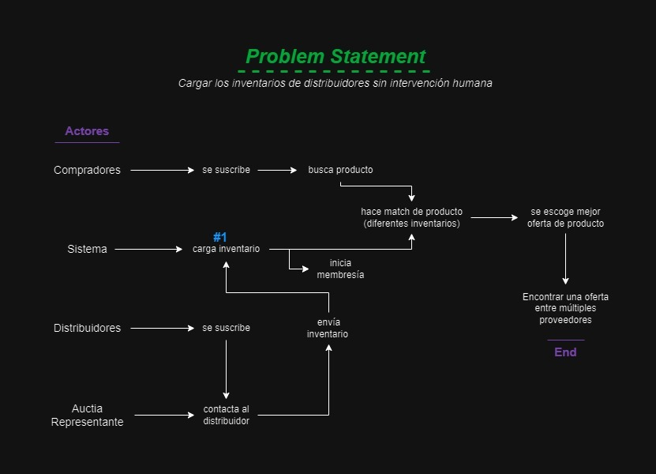
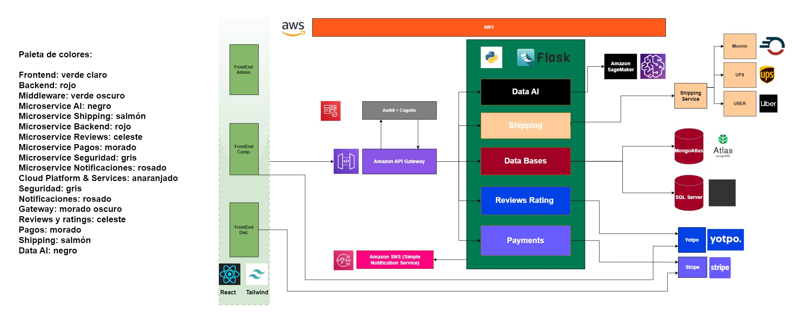
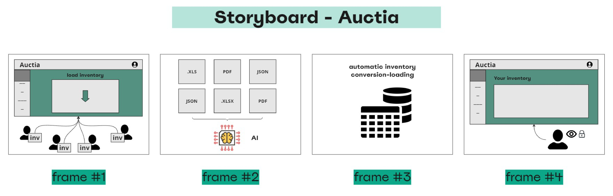
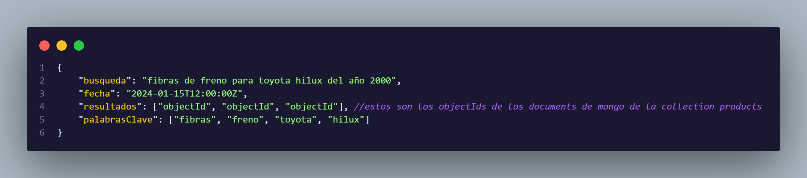
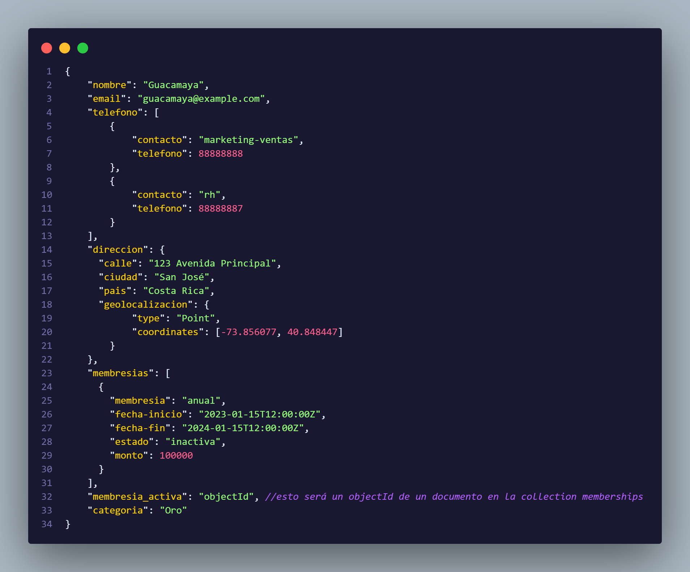
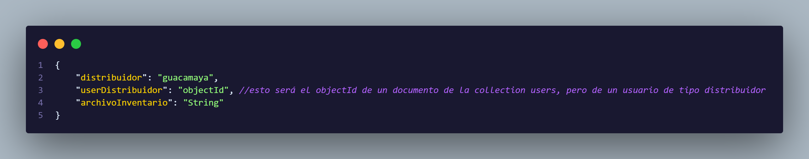
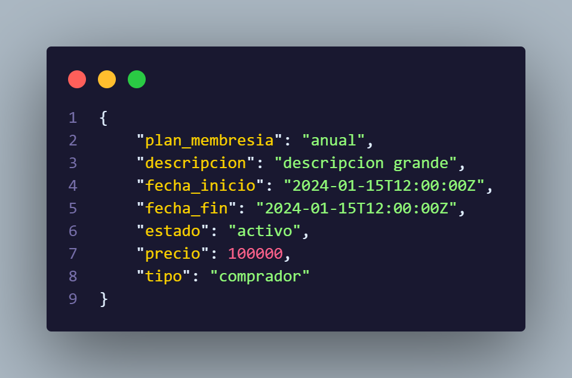
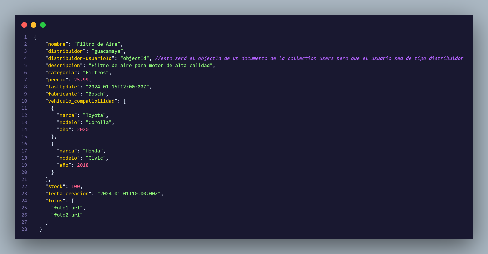
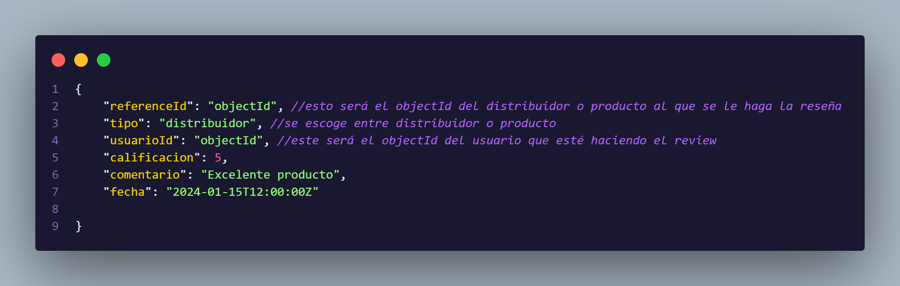
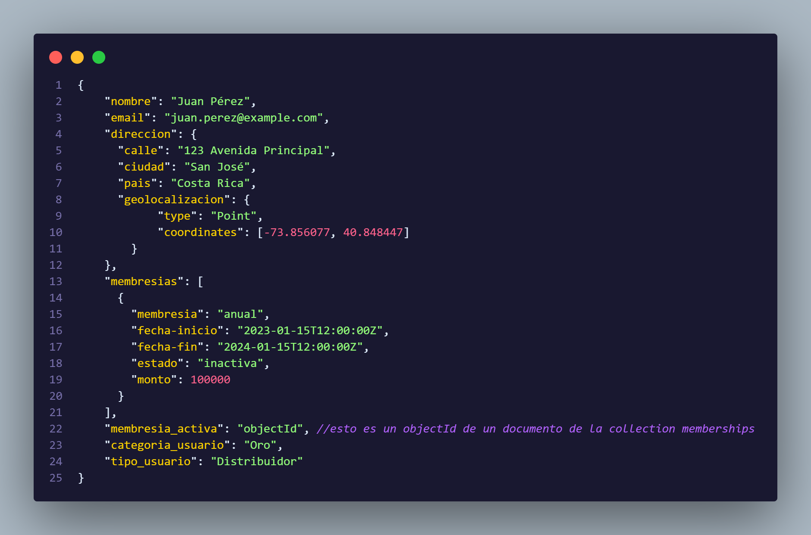

# Auctia
E-commerce of automotive spare parts.

El proyecto va a ser una especie de sistema de subastas que funcionará de la siguiente forma: El usuario final buscará el producto que necesita comprar, y el sistema le ayudará a conectar con una serie de distribuidores asociados, los cuales le darán un precio y disponibilidad de su producto solicitado. De esta forma el usuario que desea comprar el producto, tendrá una serie de opciones variadas para comprar del proveedor que desee, y una vez escoja con cual quiere comprar, se le notificará a esta distribuidora para continuar con la compra. Con este proyecto se busca resolver el largo proceso de búsqueda de proveedores que puede tener un usuario al intentar comprar en línea, y a la vez se mejora la experiencia del usuario ya que se le hace posible tener diferentes opciones y escoger a conveniencia. Este proyecto inicialmente será aplicado en un nicho más reducido, y se enfocará únicamente en la subasta de repuestos mecánicos, por lo que inicialmente las personas a las que se dirige el proyecto serán a talleres y ventas de repuesto más pequeñas.
El problema que se busca resolver, inicialmente para el nicho de la venta de repuestos, es que cuando un taller necesita comprar repuestos, debe realizar un proceso de búsqueda muy manual, ya que debe preguntar a cada una de sus distribuidoras (únicamente las que tengan contacto) por disponibilidad del repuesto y precio. El objetivo es optimizar este proceso y eliminar la búsqueda manual, ya que en vez de preguntar individualmente a cada proveedor, podrá buscar en el sistema lo que necesite, y el mismo sistema hará la búsqueda en los proveedores y le retornará las opciones de compra, en las cuales puede que incluso el usuario final tenga una variedad de opciones de distribuidores más amplia de la que tenía inicialmente.

## Índice
- [Problem Statement](#problem-statement)
- [Requerimientos Funcionales](#requerimientos-funcionales)
- [Diagrama Arquitectura](#diagrama-arquitectura)
- [Storyboard](#storyboard)
- [Requerimientos No Funcionales](#requerimientos-no-funcionales)
- [Front-end](#front-end)
- [Back-end](#back-end)
- [Datos](#datos)

## Problem Statement
Cargar los inventarios de los distribuidores sin intervención humana.

## Requerimientos Funcionales
1- Carga de Inventario.
1- Búsqueda de Productos.
1- Revisión de ofertas de Taller.
1- Administración de Usuario.
2- Administración de Membresía.
1- Monitoreo de Transacciones.
1- Decidir si registrarse como comprador (taller) o distribuidor.
1- Validación de requisitos legales.
1- Gestión de compras (historial).
1- Información del cliente y método de pago.
1- Acceso a catálogos.

2- Carga Automatizada Personalizada.
2- Envíos.
2- Notificaciones.
2- AI estadísticas y sugerencias para competir en el mercado. (Revisión de Ofertas de Distribuidora)
2- Filtro por productos, precios, ubicación, categorías.
2- Sistema de puntuaciones y referencias.
2- Configuración de Fees.
2- Manejo de Membresía.

3- Configuración Tipos de Pago.
3- AI de validación de requisitos legales.

## Diagrama Arquitectura

## Storyboard
### Crazy 8's
La técnica de Crazy 8's es un ejercicio de ideación rápido y eficaz utilizado en el diseño y desarrollo de productos para generar una diversidad de ideas en un corto período de tiempo.
Las ideas más prometedoras fueron seleccionadas mediante un consenso. Se priorizaron aquellas que directamente abordaban las necesidades identificadas en el problem statement y que eran técnicamente viables dentro de los límites del proyecto.

## Requerimientos No Funcionales

### Performance

#### Tiempo de respuesta esperado:
- Bajo carga normal: Menos de 200ms para consultas de productos y datos de usuarios.
- Bajo carga máxima (picos de usuarios): Hasta 500ms.
#### Soporte de usuarios concurrentes:
El sistema debe soportar hasta 500 usuarios concurrentes en las primeras fases.
Escalable a 2000 usuarios en los próximos 2 años.
#### Benchmark de operaciones críticas:
Las transacciones de compra no deben exceder los 2 segundos, con validación de pago en tiempo real.

### Scalability

#### Manejo de cargas crecientes:
El sistema debe escalar horizontalmente utilizando AWS Auto Scaling para manejar el incremento de tráfico y almacenamiento en MongoDB Atlas.
Se prevé un aumento anual del 15% en volumen de datos.
#### Escalabilidad por componentes:
La API de Flask debe escalar en Docker Swarm o Kubernetes para manejar más tráfico, y Redis debe escalar con particionamiento para grandes volúmenes de datos en caché.

### Reliability

#### Downtime aceptable:
El sistema debe tener un 99.9% de disponibilidad, lo que equivale a un máximo de 8.76 horas de downtime anual.
#### Manejo de fallos:
En caso de fallo, AWS Elastic Load Balancer debe redirigir el tráfico a instancias en funcionamiento.
Backups automáticos diarios en MongoDB Atlas y SQL Server deben garantizar la integridad de los datos.
#### Procedimientos de recuperación:
Recuperación en menos de 15 minutos utilizando snapshots automáticos de AWS RDS y MongoDB Atlas.

### Availability

#### Requerimientos de uptime:
La disponibilidad debe ser del 99.9%, con monitorización activa usando AWS CloudWatch y alertas en caso de caídas del sistema.
#### Disponibilidad sin fallos:
Los momentos críticos incluyen horas de alta demanda de talleres y servicios, principalmente lunes a viernes de 8:00 AM a 6:00 PM.

### Security

#### Seguridad en almacenamiento y transmisión:
Uso de cifrado SSL/TLS para todas las comunicaciones.
MongoDB Atlas y SQL Server deben cifrar los datos en reposo.
#### Autenticación y autorización:
Implementar autenticación OAuth 2.0 para usuarios y sistemas externos.
#### Requisitos de cumplimiento:
El sistema debe cumplir con la Ley de Protección de Datos de Costa Rica y GDPR para los datos personales de usuarios europeos.

### Usability

#### Estándares de usabilidad:
La interfaz debe cumplir con los principios de Usabilidad de Nielsen, garantizando navegación intuitiva y respuesta rápida.
#### Accesibilidad:
Debe cumplir con los estándares WCAG 2.1 AA para accesibilidad, incluyendo compatibilidad con lectores de pantalla y opciones de alto contraste.
#### Capacitación de usuarios:
Se proporcionará documentación interactiva y video tutoriales de uso a través de la plataforma.

### Maintainability

#### Facilidad de actualización:
Las actualizaciones deben realizarse sin afectar el tiempo de actividad, utilizando despliegue continuo (CI/CD) con GitLab Pipelines.
#### Requerimientos de logging:
Logs de actividad generados en AWS CloudWatch, con alertas automáticas para errores críticos.
#### Version control:
Uso de Git para el control de versiones y Docker para aislar dependencias.

### Interoperability

#### Integración con otros sistemas:
El sistema debe integrarse con Stripe para pagos, Twilio para notificaciones, y AWS SES para emails transaccionales.
#### Protocolos estándar:
Uso de REST APIs con JSON como formato de intercambio de datos y Webhooks para notificaciones en tiempo real.

### Compliance

#### Cumplimiento legal y regulatorio:
Cumplir con GDPR y la Ley de Protección de Datos de cada país en donde opere.
#### Estándares específicos de la industria:
Cumplir con los estándares de comercio electrónico seguros, como PCI DSS para transacciones financieras.

### Extensibility

#### Diseño para futuras mejoras:
Arquitectura basada en microservicios para permitir la incorporación de nuevos módulos sin afectar el sistema principal.
#### Áreas críticas de extensibilidad:
Nuevas regiones y monedas para operaciones internacionales.

### Localization

#### Soporte de idiomas y regiones:
El sistema debe ser multilingüe (soportando inglés y español), y ajustar los formatos de fecha y moneda automáticamente usando i18n de Flask-Babel.
#### Formatos regionales:
Soporte para distintas zonas horarias y formatos de moneda, manejados dinámicamente desde el backend.

### Documentation

#### Documentación requerida:
Documentación detallada para usuarios finales, administradores y desarrolladores.
#### Mantenimiento de la documentación:
Usar Swagger para documentar las APIs y Confluence para mantener y actualizar la documentación técnica.

## Front-end

El frontend del proyecto está disponible en el siguiente subfolder: [Front-end](./frontend).

Para más detalles, consulta la documentación interna del frontend. [README.md](./frontend/README.md).

## Back-end

El backend del proyecto está disponible en el siguiente subfolder: [Back-end](./backend).

Para más detalles, consulta la documentación interna del backend. [README.md](./backend/README.md).

## Datos

[bitacoraSearches](./backend/Auctia-Boilerplate/data/bitacoraSearches.json).

[distribuidores](./backend/Auctia-Boilerplate/data/distribuidores.json).

[inventario](./backend/Auctia-Boilerplate/data/inventario.json).

[membresias](./backend/Auctia-Boilerplate/data/membresias.json).

[producto](./backend/Auctia-Boilerplate/data/producto.json).

[reseñas](./backend/Auctia-Boilerplate/data/reseñas.json).

[user](./backend/Auctia-Boilerplate/data/user.json).
