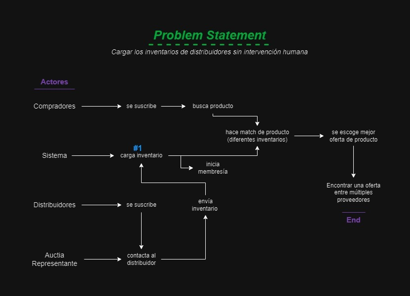

# Auctia
E-commerce of automotive spare parts.

## Índice
- [Problem Statement](#problem-statement)
- [Storyboard](#storyboard)

## Problem Statement
Cargar los inventarios de los distribuidores sin intervención humana.

Por ejemplo:
> "En el contexto de [contexto general del problema], hemos identificado que [descripción específica del problema]. Este proyecto busca resolver este problema mediante [tu solución propuesta]."

## Storyboard
### Crazy 8's
Explica brevemente qué es la técnica de Crazy 8's y cómo la utilizaste para generar ideas en tu proyecto. Luego, incluye las imágenes de los storyboards creados.

Puedes insertar imágenes usando Markdown así:

Para cada imagen, proporciona una breve descripción o título que explique qué aspecto del problema o qué solución está ilustrando cada storyboard.

### Análisis de las Ideas
Discute cómo seleccionaste o refinaste las ideas generadas a través de los Crazy 8's. ¿Cuáles ideas fueron llevadas adelante y por qué?
