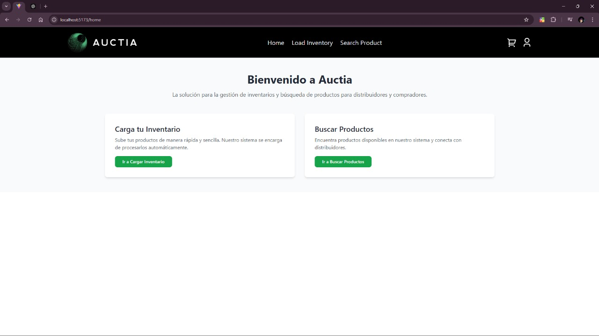
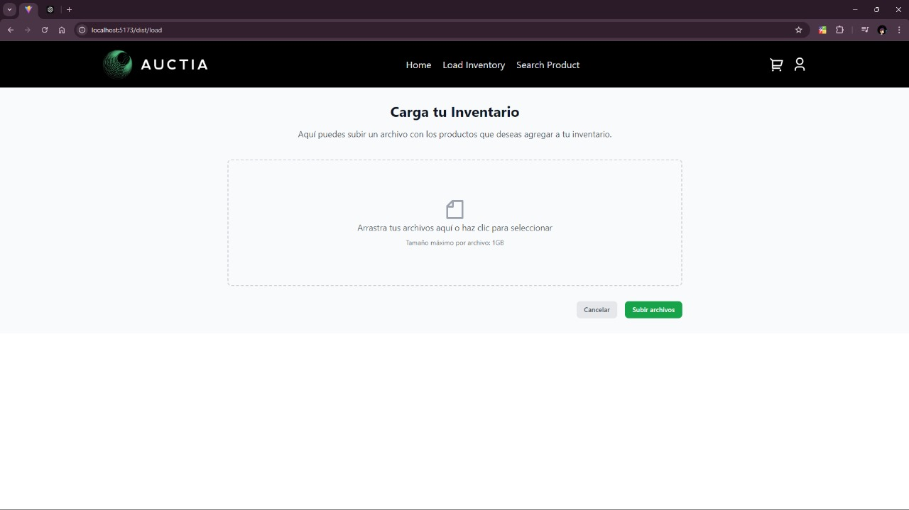
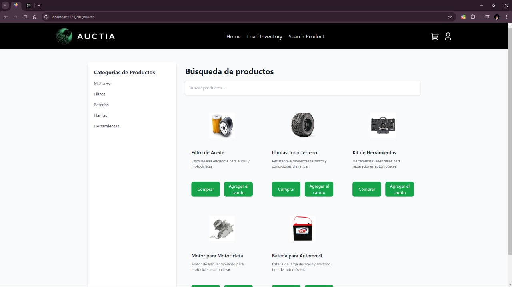

# Documentación de Pantallas - Auctia

## Pantalla: HomePage

### Descripción:
La pantalla principal de la aplicación donde los distribuidores pueden acceder a las funciones principales: Cargar Inventario y Buscar Productos.

### Componentes:
- **Botones**: "Ir a Cargar Inventario" y "Ir a Buscar Productos".
- **Mensajes**: Muestra la bienvenida al sistema y explica la funcionalidad principal.

### Acciones y Mensajes:
1. Al hacer clic en "Cargar Inventario", el usuario es redirigido a la pantalla para cargar archivos de inventario.
2. Al hacer clic en "Buscar Productos", el usuario es redirigido a la pantalla para buscar productos en la base de datos.
   
_Screenshot de la pantalla:_

---

## Pantalla: LoadInventory

### Descripción:
Pantalla donde los distribuidores pueden cargar archivos de inventario.

### Componentes:
- **Área de Dropzone**: Permite arrastrar y soltar los archivos de inventario para cargarlos.
- **Lista de archivos**: Muestra los archivos seleccionados para cargar.
- **Botón "Subir Archivos"**: Inicia el proceso de carga de archivos al servidor.

### Acciones y Mensajes:
1. **Subir archivo(s)**: Cuando el archivo es cargado correctamente, muestra un mensaje de éxito.
2. **Error**: Si hay un problema en la carga, aparece un mensaje de error: "Error al cargar archivo(s)".
   
_Screenshot de la pantalla:_

---

## Pantalla: SearchProduct

### Descripción:
Pantalla donde los distribuidores pueden buscar productos y agregarlos al carrito o a la wishlist.

### Componentes:
- **Barra de búsqueda**: Permite filtrar productos en función del nombre o categoría.
- **Listado de productos**: Muestra los productos encontrados según la búsqueda realizada.

### Acciones y Mensajes:
1. **Búsqueda**: Introduce el término de búsqueda y muestra productos que coinciden.
2. **Agregar al carrito/wishlist**: Se despliega un mensaje de éxito al agregar productos al carrito o wishlist.
   
_Screenshot de la pantalla:_

---

