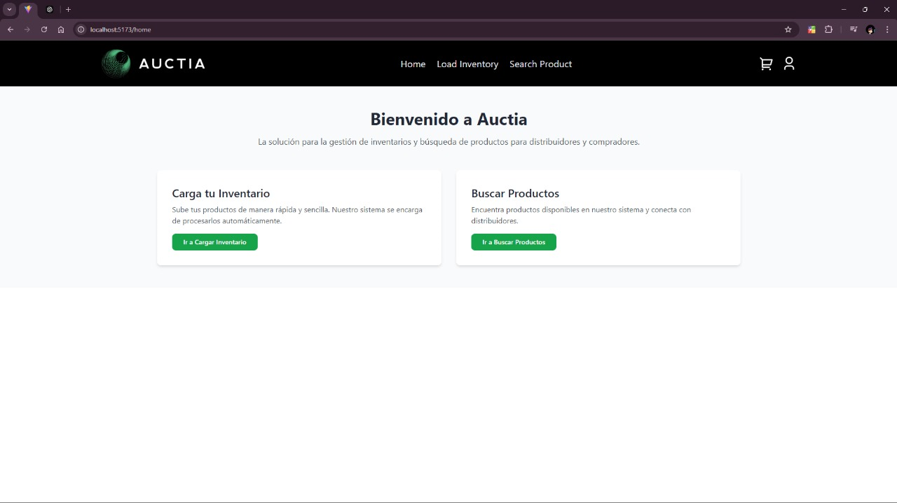
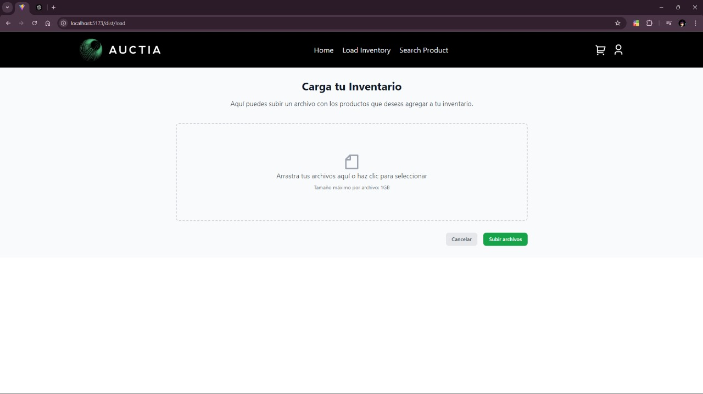
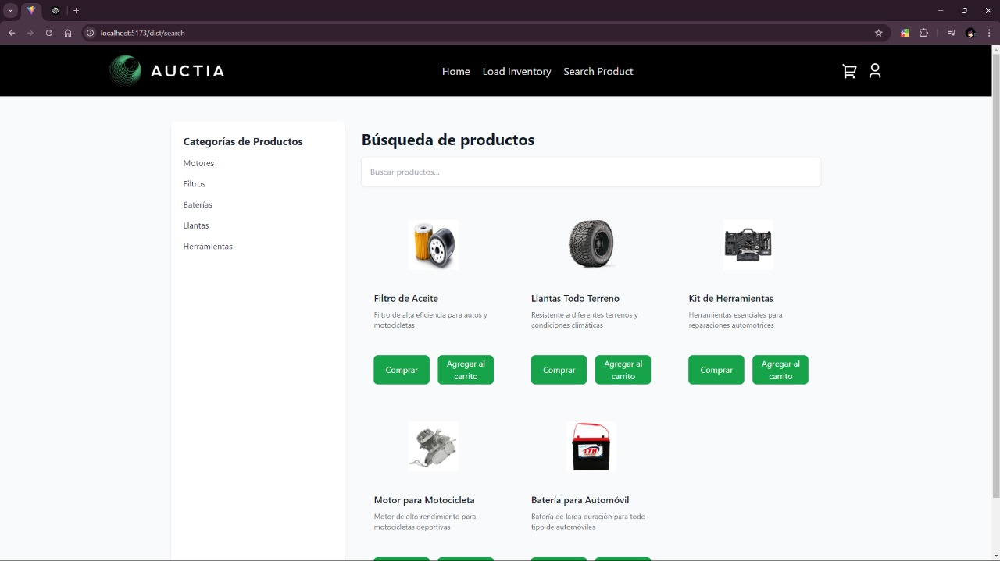
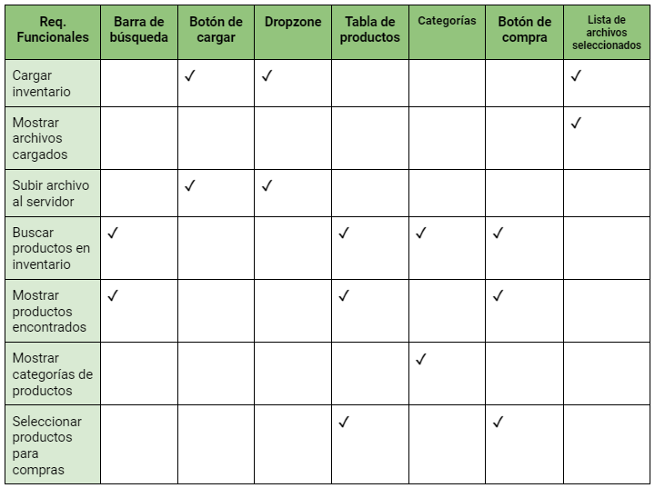

# Frontend

## Índice
- [Descripción General](#descripción-general)
- [Estructura del proyecto](#estructura-del-proyecto)
- [Pantallas](#pantallas)
- [Matriz de requerimientos funcionales vs. componentes visuales](#matriz-de-requerimientos-funcionales-vs-componentes-visuales)
- [Comandos](#comandos)

## Descripción General

Este proyecto contiene el frontend para ciertas pantallas de Auctia, en donde los distribuidores pueden cargar archivos a sus inventarios y buscar productos en la plataforma.

## Estructura del Proyecto

```plaintext
/src
  ├── /assets
  │   ├── /icons        # Imágenes y logos de la aplicación
  │   │   ├── dummy1.jpg
  │   │   ├── dummy2.jpg
  │   │   ├── dummy3.jpg
  │   │   ├── dummy4.jpg
  │   │   ├── dummy5.jpg
  │   │   ├── logo.jpg
  │   │   ├── logo1.jpg
  │   │   └── logo2.jpg
  │   └── /screenshots  # Capturas de pantalla para la documentación
  │       └── MatrixReqsComponents.png
  │       └── HomePage.png
  │       └── LoadInventory.png
  │       └── SearchProduct.png
  │
  ├── /components
  │   ├── /general
  │   │   ├── InventoryFile.ts
  │   │   ├── InventoryLoader.ts
  │   │   └── LoadInventoryManager.ts
  │   ├── /layouts
  │   │   ├── FileUpload.tsx
  │   │   ├── Header.tsx
  │   │   ├── InventoryTable.tsx
  │   │   ├── SearchSideBar.tsx
  │   │   └── UploadButton.tsx
  │
  ├── /contexts
  │   ├── InventoryContext.ts
  │   └── UserContext.ts
  │
  ├── /hooks
  │   ├── useFileUpload.ts
  │   ├── useInventory.ts
  │   └── useProductSearch.ts
  │
  ├── /pages
  │   ├── HomePage.tsx
  │   ├── LoadInventory.tsx
  │   └── SearchProduct.tsx
  │
  ├── /router
  │   ├── Router.tsx
  │   └── ConfigService.ts
  │   └── paths.ts
  │
  ├── /services
  │   ├── APIService.ts
  │   ├── APIGatewayService.ts
  │   ├── DistributorService.ts
  │   ├── FileUploadService.ts
  │   ├── InventoryService.ts
  │   ├── PaymentAdapter.ts
  │   ├── PaymentService.ts
  │   ├── PayPalAdapter.ts
  │   ├── ProductSearchService.ts
  │   ├── StripeAdapter.ts
  │   └── StripeService.ts
  │
  ├── /types
  │   ├── File.ts
  │   ├── InventoryTypes.ts
  │   ├── Product.ts
  │   └── UserTypes.ts
  │
  ├── App.tsx
  ├── main.tsx


```
### /assets: 

Contiene imágenes y logos usados en la aplicación.

### /components: 

Contiene los componentes generales y de layout (como el FileUpload, Header, etc.).

### /contexts: 

Proveedores de contexto para el manejo de estados globales (e.g. UserContext, InventoryContext).

### /hooks: 

Hooks personalizados para manejar lógicas específicas (e.g. useFileUpload, useProductSearch).

### /pages: 

Las principales páginas del sistema (HomePage, LoadInventory, SearchProduct).

### /services: 

Servicios para manejar la interacción con APIs o simulaciones (ProductSearchService, InventoryService, etc.).

### /types: 

Definiciones de tipos para mejorar el tipado (e.g. File.ts, InventoryTypes.ts).

### /utils: 

Contiene funciones y helpers reutilizables.

## Pantallas

### Pantalla: HomePage

#### Descripción:
La pantalla principal de la aplicación donde los distribuidores pueden acceder a las funciones principales: Cargar Inventario y Buscar Productos.

#### Componentes:
- **Botones**: "Ir a Cargar Inventario" y "Ir a Buscar Productos".
- **Mensajes**: Muestra la bienvenida al sistema y explica la funcionalidad principal.

#### Acciones y Mensajes:
1. Al hacer clic en "Cargar Inventario", el usuario es redirigido a la pantalla para cargar archivos de inventario.
2. Al hacer clic en "Buscar Productos", el usuario es redirigido a la pantalla para buscar productos en la base de datos.



---

### Pantalla: LoadInventory

#### Descripción:
Pantalla donde los distribuidores pueden cargar archivos de inventario.

#### Componentes:
- **Área de Dropzone**: Permite arrastrar y soltar los archivos de inventario para cargarlos.
- **Lista de archivos**: Muestra los archivos seleccionados para cargar.
- **Botón "Subir Archivos"**: Inicia el proceso de carga de archivos al servidor.

#### Acciones y Mensajes:
1. **Subir archivo(s)**: Cuando el archivo es cargado correctamente, muestra un mensaje de éxito.
2. **Error**: Si hay un problema en la carga, aparece un mensaje de error: "Error al cargar archivo(s)".



---

### Pantalla: SearchProduct

#### Descripción:
Pantalla donde los distribuidores pueden buscar productos y agregarlos al carrito o a la wishlist.

#### Componentes:
- **Barra de búsqueda**: Permite filtrar productos en función del nombre o categoría.
- **Listado de productos**: Muestra los productos encontrados según la búsqueda realizada.

#### Acciones y Mensajes:
1. **Búsqueda**: Introduce el término de búsqueda y muestra productos que coinciden.
2. **Agregar al carrito/wishlist**: Se despliega un mensaje de éxito al agregar productos al carrito o wishlist.



## Matriz de requerimientos funcionales vs. componentes visuales



## Comandos

### Instalar y configurar Tailwind CSS

npm install -D tailwindcss postcss autoprefixer  
npx tailwindcss init -p  

### Instalación y configuración de Vite

npm install vite  
npm init  

### Instalar dependencias del proyecto

npm install  

### Ejecutar el servidor de desarrollo

npm run dev  

### Detener el servidor de desarrollo

1. Ctrl+C  
2. Luego presionar 'y'
